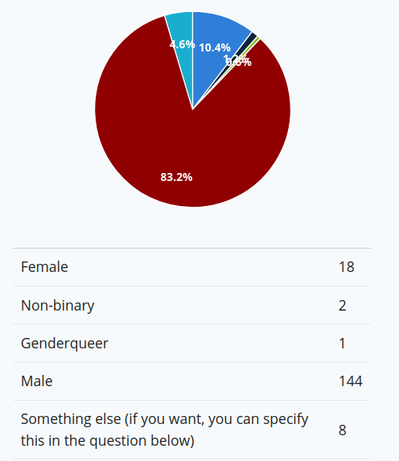
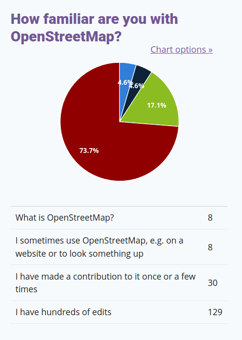

_# MapComplete user census

As you noticed, MapComplete ran a user survey during january.
What did it tell us?

The use survey had a few goals, namely:

- discovering what demographics are using MapComplete
- and discovering what needs and wants are still there

## Basic demography

The first question is of course: who did fill out the survey? If we look to the numbers, a clear pattern emerges.

The age distribution looks pretty normal - there is a clear peak around the bucket `30-40`, which falls down left and right.

The gender is not as balanced. Unsurprisingly, the majority of respondents is male:

Around 10% of respondents identified as female; and 11 people identified as having a non-conventional gender.
Note that there was _no_ option for trans people - they could choose between either their chosen gender or use the 'something else'. As such, I don't know how much trans people are in each category. One person, identifying as female however stated to be trans (and I suspect that there are a few more).

This tells us that women are vastly underrepresented in this survey - ideally they would be around 50%.

In the same vein, non conventional genders are vastly overrepresented in this survey. [According to Wikipedia](https://en.wikipedia.org/wiki/Non-binary_gender#Population_figures), about 0.5% of adult populations identify as non-binary. With 11 out of 177 respondents using a non-conventional gender, we end up at 6%. It seems like we are a pretty welcome community - or at least I hope so.
Fun fact: it's a bit of a running joke that many trans-people are programmers. 7 out of 11 of the respondents who picked genderqueer/non-binary/something-else also indicated that they _are developers or studied computer science_, so this stereotype holds up...

But this might also be a statistical bias. 55% of _all_ respondents indicated that they are programmers:

Now, this is a bit painful. MapComplete aims to be an easy-to-use tool for non-technical users. The survey clearly failed to reach these people.

This is also mirrored in the question on how good they know OpenStreetMap. Close to 75% indicate to have at least hundreds of edits.

In practice, the communication about the survey should reach respondents which then, need to be motivated to fill out this survey.

As the survey has been promoted via [Mastodon](https://en.osm.town/@mapcomplete), this probably had a major influence: Mastodon has a userbase which is both very developer-oriented but also quite queer and has (relatively) many transgender and genderqueer people. As the post about the survey gained a lot of traction there, I suspect many found the survey via that channel.

A second important effect is the language. The invitation for the survey and the survey itself where all in english. Developers are generally fluent in English, but a non-technical user might not bother with a survey that is not in their native tongue.

At last, some people from minorities are less likely to fill out surveys ([source](https://files.eric.ed.gov/fulltext/ED501717.pdf)). I tried to counter this by explicitly inviting those groups to fill out the survey in the request, but this psychological effect is very hard to measure.

As such, while I do think that the data is mostly representative, I think that less-technical people are a bit underrepresented.

### Identity

A last question in the 'demograpy'-set was "how would you describe yourself?" - a notoriously hard question which only 66 persons (37%) answered.

This question is intentionally open-ended, as people will state what _they_ find important in live.

18 of them mentioned to be a map lover or OSM lover, 15 self-identified as being a 'techie', 'developer', 'engineer' or similar. 8 found Open Source-software important; 7 mentioned to be interested in environmentalism, urbanism, transportation and/or political issues. Other notable mentions were to be involved (professionally) with GIS. Other notable categories are teachers (2), cyclists (4) and climbers (2). One person indicated that they were 'disabled'.

## Reach

How did people get in touch with MC? How well-known is it?
How did SC and ED gain users quickly?

## Usecases

Why do people use MC?
What would people still want?
What issues do they report?

## Good questions to ask next year?
